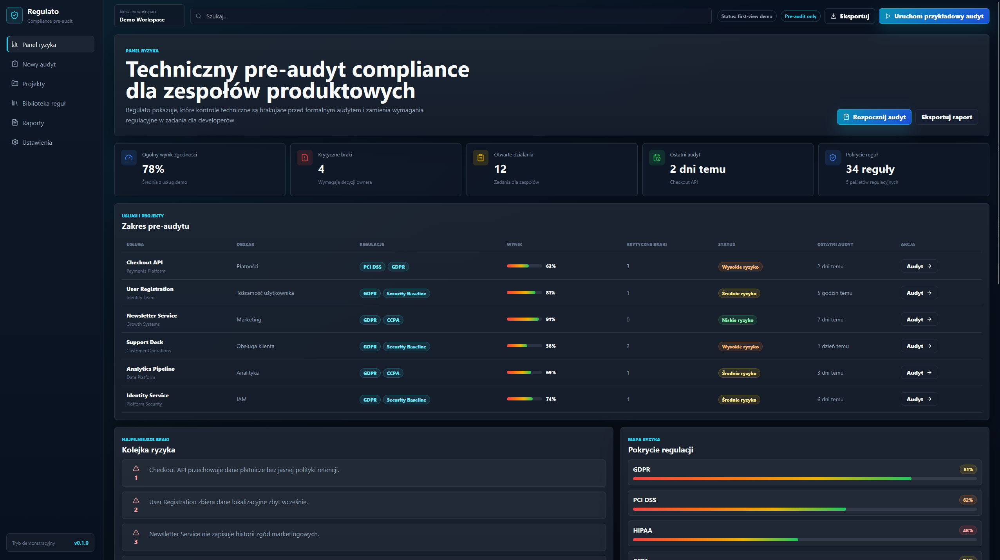
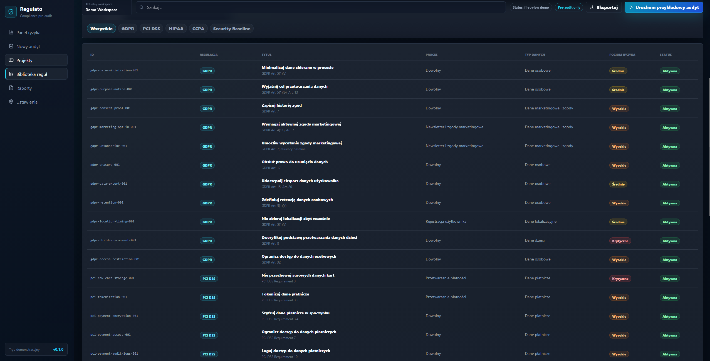
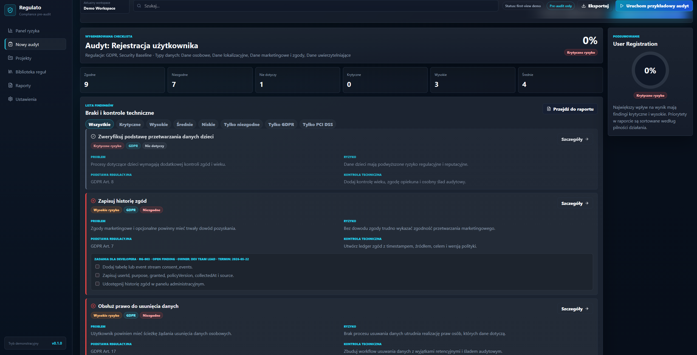
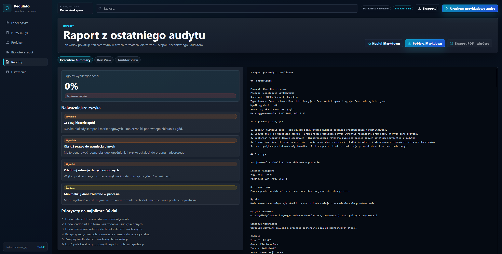

# Regulato

Developer-first compliance pre-audit dashboard.

Regulato is a polished first-view demo of a rules-based compliance tool for engineering, security and product teams. It translates regulatory requirements into technical controls, remediation tasks and audit-ready findings.

> Educational and pre-audit use only. This project does not provide legal advice.

## Highlights

- Polish enterprise-style risk dashboard
- Audit wizard for process, regulations, data types and architecture questions
- Rules-based checklist generation
- Starter rules for GDPR, PCI DSS, HIPAA, CCPA and Security Baseline
- Finding details with risk, business impact, evidence and developer tasks
- Remediation board with owner, task ID and due date
- Rules library and industry pattern library
- Markdown report export

## Tech Stack

- Vite
- React
- TypeScript
- CSS custom properties
- lucide-react
- Local TypeScript rules engine

## Getting Started

```bash
npm install
npm run dev
```

Build check:

```bash
npm run build
```

## Screenshots

#### Dashboard


#### Rules Library


#### Results


#### Report


## Project Structure

```text
src/
  components/
  data/
  lib/
  App.tsx
  styles.css
docs/
public/screenshots/
```

## Status

This repository is currently closed as a first-view portfolio demo. The next phase can add persistence, authentication, team workflows and real integrations.
