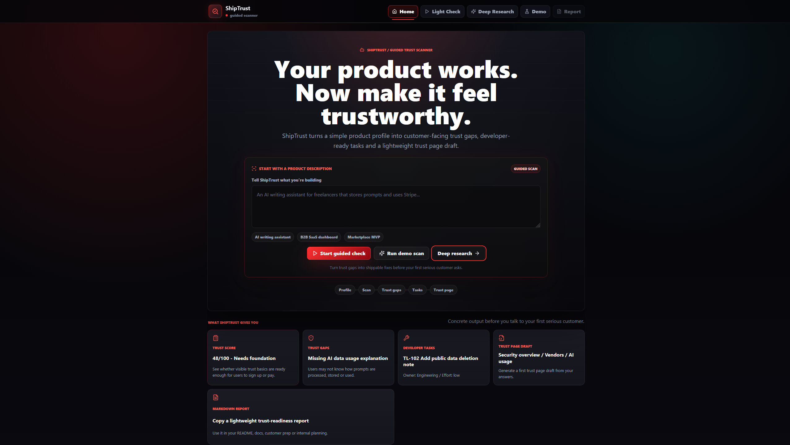
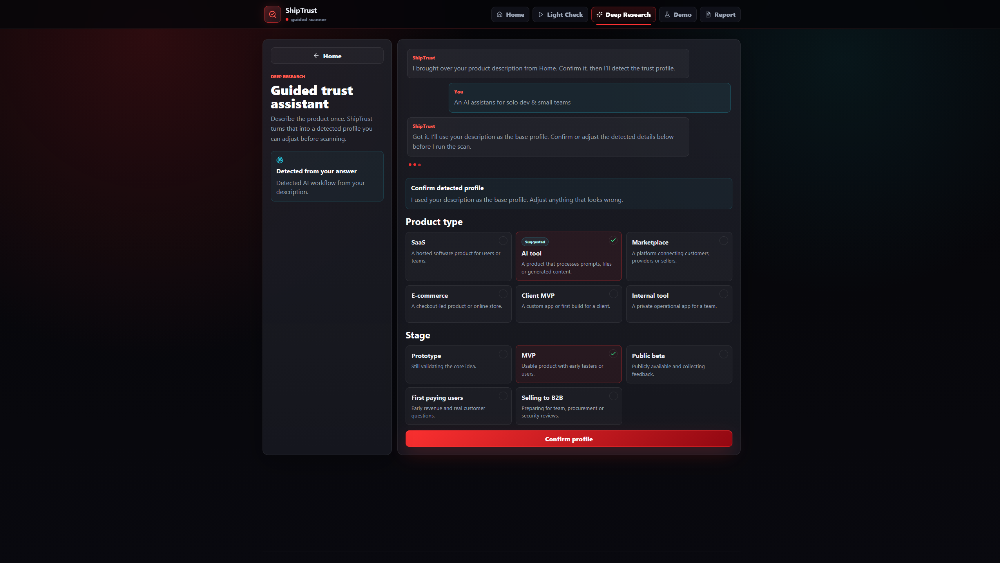
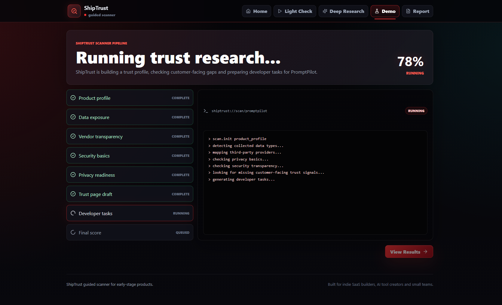
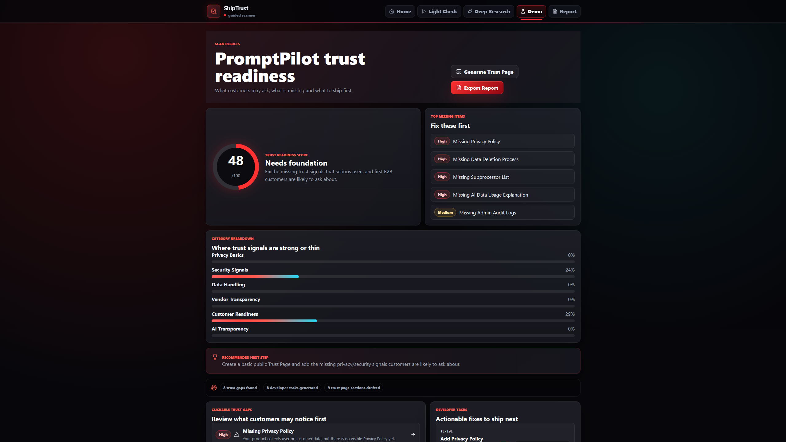
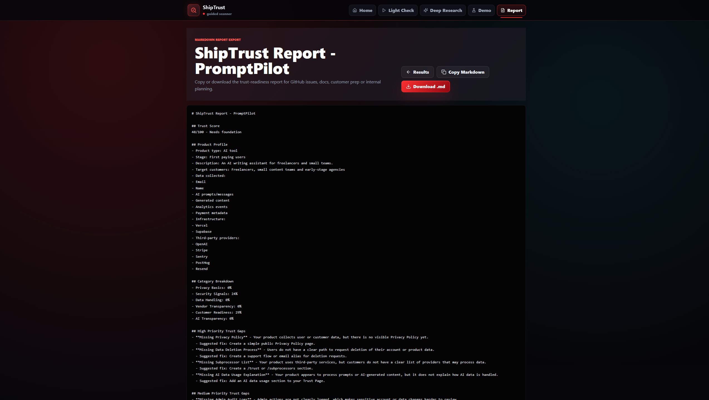

# ShipTrust

ShipTrust is a guided trust-readiness scanner for indie SaaS builders, AI tool creators and small teams.

It helps app builders understand how trustworthy their product looks before users decide to sign up, pay, or leave.

## What is ShipTrust?

ShipTrust turns a simple product profile into practical trust-readiness output:
- trust score
- customer-facing trust gaps
- developer-ready tasks
- trust page draft
- markdown report

The product is built for early-stage teams that need to see what users or first B2B customers may question before they pay.

## Why this exists

Early-stage products often work before they look trustworthy.

ShipTrust helps builders answer questions like:
- What trust signals are missing from the product?
- Which customer-facing gaps should be fixed first?
- What developer tasks can be shipped quickly?
- What should a lightweight trust page include?

## Current status

ShipTrust is a frontend-only MVP for validating the product direction.

Current implementation:
- Vite + React + TypeScript
- local state
- local static rules engine
- demo product data
- generated trust score
- generated trust gaps
- generated developer tasks
- trust page draft
- markdown report export

Not included yet:
- backend
- auth
- database
- real AI API
- external integrations

## Core flow

1. Describe your app.
2. Answer guided questions.
3. Watch ShipTrust run an animated scan.
4. Review trust score and trust gaps.
5. Open finding details.
6. Turn gaps into developer tasks.
7. Generate a trust page draft.
8. Copy or download a markdown report.

## Features

- **AI-style Home entry**: start from a product description and move into a guided scan.
- **Light Check**: quick guided check for early-stage products.
- **Deep Research**: guided assistant that uses the product description as the base profile.
- **Animated analysis**: staged scanner pipeline with terminal-style logs.
- **Results dashboard**: trust score, category breakdown, top gaps and recommended next step.
- **Finding drawer**: actionable detail for each trust gap.
- **Developer tasks**: generated task list with priority, effort and owner.
- **Trust Page Generator**: draft sections for a simple public trust page.
- **Markdown report**: copy or download a lightweight trust-readiness report.

## Screenshots

### Home / Guided entry



### Deep Research



### Demo Research



### Demo Results



### Report Page



## Demo product

The included demo scan uses **PromptPilot**, an AI writing assistant for freelancers and small teams.

It demonstrates realistic early-stage gaps such as:
- missing Privacy Policy
- missing subprocessor list
- missing AI data usage explanation
- missing data deletion process
- missing public security contact

## Tech stack

- Vite
- React
- TypeScript
- CSS custom properties / plain CSS
- lucide-react
- local static rules engine

## Roadmap

- **v0.2 - ShipTrust guided trust scanner**: current public MVP and visual direction.
- **v0.3 - Stronger guided profile**: better product description handling and smarter guided questions.
- **v0.4 - Better trust page and report output**: richer generated sections and cleaner export flow.
- **v0.5 - Saved scans and shareable reports**: persistence, saved projects and shareable links.
- **Later**: backend, auth, AI-assisted analysis and integrations.

## Local development

```bash
npm install
npm run dev
```

Build check:

```bash
npm run build
```

Type check:

```bash
npm run lint
```

## Disclaimer / scope

ShipTrust is an educational trust-readiness product. It does not provide legal advice, certification or a substitute for professional review.

The current MVP is designed for early product validation and customer-readiness planning.
